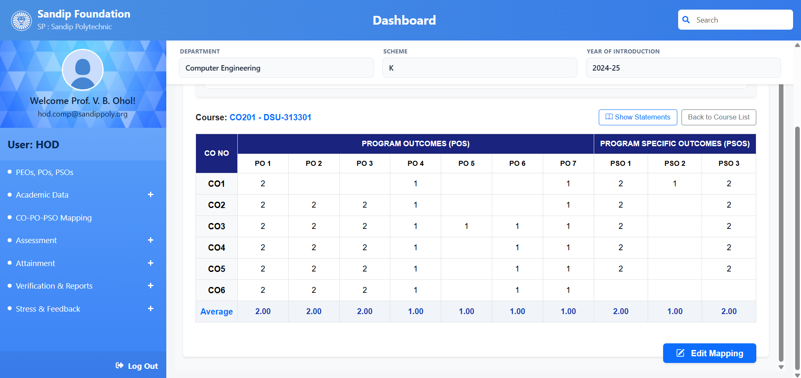

# ⚠️ Project Status: Archived & Completed (Capstone Project)

This repository contains the definitive, final capstone project built by the original foundational engineering team in **2026**. This codebase is frozen and is no longer being actively maintained.

### 🛑 Notice for Continuing Student Batches (Juniors):
1. **Do Not Open PRs Here**: This repository is an academic archive. Do not submit Pull Requests to this origin. You must **Fork** this repository to your own GitHub account and configure your local git settings to push to your own fork.
2. **Academic Credit**: Any future development, derivatives, or extensions of this codebase by subsequent student batches must explicitly credit the original authors listed below in all documentation, reports, presentations, and submissions.
3. **Known Issues**: Before writing any new code, you are strictly required to read `DEFECT_REPORT.md` in the root directory. It lists 15 critical bugs, security gaps (such as unauthenticated endpoints), and scaling constraints that you must resolve first.

---

# OBE Tracking System

A full-stack web application designed to manage Outcome Based Education (OBE) processes, including CO-PO-PSO mapping, automating attainment calculations, and student stress analysis, aligned with NBA requirements (Criterion 3).
---
## Key Features

- Role-Based Access Control (RBAC) for multiple user roles (Admin, HOD, Faculty, Coordinator, Auditor)
- Automated attainment calculation engine
- Excel-based bulk data upload and report generation
- Anonymous student stress survey module
- Role-specific dashboards and workflows
---
## Original Team Members

- **Farheen** – Team Lead, Backend Integration  
- **Gayatri** – Backend Lead  
- **Khushi** – Frontend Lead  
- **Saloni** – Documentation, Testing & QA  
---
## System Overview

1. Users log in based on roles (RBAC)
2. Faculty define COs and map them to POs/PSOs
3. Student data is uploaded via Excel or through provided interface
4. System calculates attainment automatically
5. Reports are generated for analysis and accreditation
6. Stress survey data is collected and analyzed
---
## Tech Stack & Architecture

### Backend
- **Framework**: Django REST Framework (DRF)
- **Database**: SQLite (Development), PostgreSQL (Deployment)
- **Authentication**: Stateless JSON Web Tokens (JWT)
- **EMAIL API**: Google's SMTP API
 
### Frontend
- **Framework**: React.js 
- **Styling**: Bootstrap & Custom CSS Components
---
## Backend Overview

- Built using Django and Django REST Framework
- Handles authentication, RBAC, and API endpoints
- Uses PostgreSQL for structured data storage
- Processes academic data and generates reports

## Frontend Overview

- Built using React.js and Bootstrap for responsive UI  
- Provides role-based dashboards and interfaces for different users  
- Handles user interactions and sends API requests to backend  
- Displays data such as mapping details, reports, and survey results  
- Communicates with backend via REST APIs and processes JSON responses  

---

## Local Installation & Setup Guide

Follow these exact steps to launch the project locally on your machine:

### 1. Clone & Fork
First, fork this repository to your individual or group GitHub account, then clone your fork:
```bash
git clone https://github.com
cd OBE-TRACKING-SYSTEM
```

### 2. Backend Configuration (Django)
1. Navigate into the backend directory:
   ```bash
   cd backend
   ```
2. Create and activate a isolated Python virtual environment:
   ```bash
   python -m venv venv
   # On Windows:
   venv\Scripts\activate
   # On Mac/Linux:
   source venv/bin/activate
   ```
3. Install the required modules:
   ```bash
   pip install -r requirements.txt
   ```

4. **Environment Variables**: Create a `.env` file inside the `backend/` root directory. Open `.env.example`, copy its keys, paste them into your new `.env` file, and provide your local configurations (including generating your own Google App Password for mailers).

5. Apply database migrations:
   ```bash
   python manage.py migrate
   ```
6. Boot up the backend development server:
   ```bash
   python manage.py runserver
   ```
The backend API will now be listening locally at `http://127.0.0`.

### 3. Frontend Configuration (React)
1. Open a new terminal window and navigate into the frontend webapp directory:
   ```bash
   cd frontend/webapp
   ```
2. Install the node dependencies:
   ```bash
   npm install
   ```

3. **Environment Setup**: Look at `src/utils/axios.js`. As detailed in `DEFECT_REPORT.md (DEF-01)`, the API client base URL points to production. Update your local client instance or set up a frontend `.env` variable pointing to `http://127.0.0` for local development.

4. Launch the local web server:
   ```bash
   npm start
   ```
The frontend portal will automatically open in your browser at `http://localhost:3000/`.

---

## Render Deployment Constraints for New Team
If you attempt to host your fork online using Render:
* **Build Command (the one we used)**: 
   ```bash
   cd frontend/webapp && npm install && npm run build && cd ../../backend && pip install -r requirements.txt && python manage.py collectstatic --noinput
   ```
* **Start Command (the one we used)**: 
   ```bash
   cd backend && gunicorn core.wsgi:application --bind 0.0.0.0:$PORT --timeout 120
   ```

---

## Note

System access is restricted due to role-based authentication. Refer to screenshots for functionality.

## Screenshots

### Login Page
This screen provides secure user authentication using JWT and redirects users to role -
specific dashboards after successful login.


### Admin Dashboard
This dashboard provides an overview of system data, including total users, department-
wise distribution, and role-based user statistics.


### CO-PO Mapping
This interface allows mapping of course outcomes with program outcomes and program
specific outcomes along with assigned weightages.


### Direct Attainment Report (Summary)
This report shows calculated CO attainment values based on student performance in
internal and external assessments.


### Stress Survey Result Preview
This screen displays analyzed student stress levels, including overall average stress,
domain-wise analysis, and identification of major stress factors based on survey
responses.

