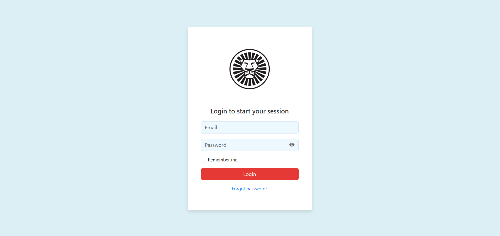
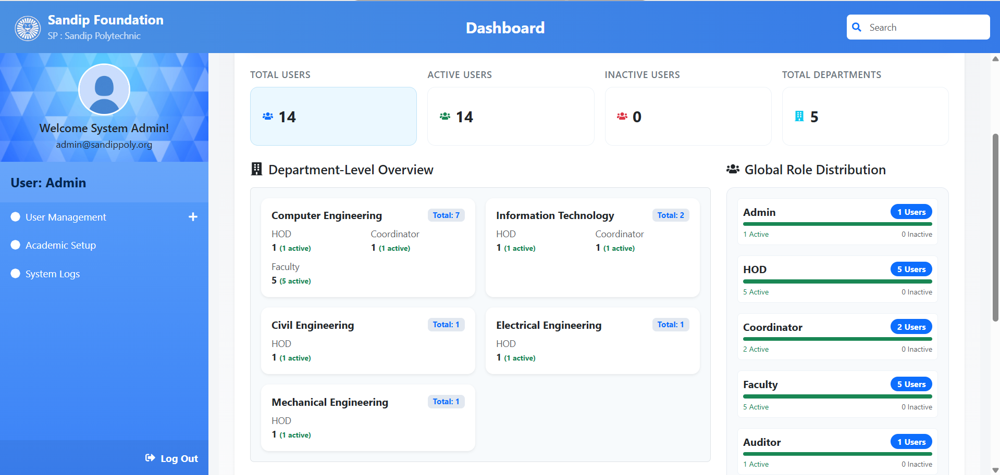
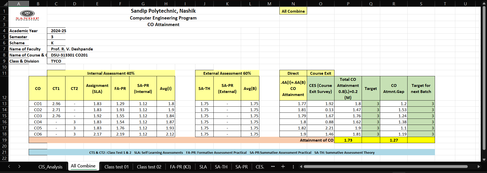
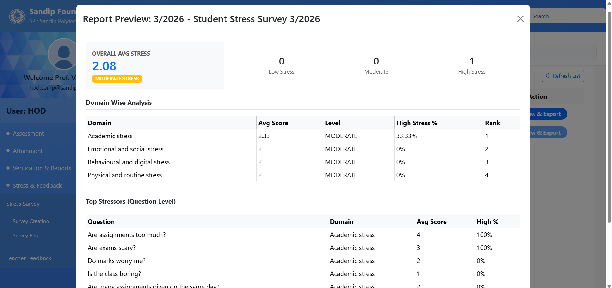

# OBE Tracking System

A full-stack web application designed to manage Outcome Based Education (OBE) processes, including CO-PO-PSO mapping, automating attainment calculations, and student stress analysis, aligned with NBA requirements.

## Key Features

- Role-Based Access Control (RBAC) for multiple user roles (Admin, HOD, Faculty, Coordinator, Auditor)
- Automated attainment calculation engine
- Excel-based bulk data upload and report generation
- Anonymous student stress survey module
- Role-specific dashboards and workflows

## Team Members

- Khushi – Frontend Lead  
- Gayatri – Backend Lead  
- Saloni – Documentation, Testing & QA  
- Farheen – Team Lead, Backend Integration  

## System Overview

1. Users log in based on roles (RBAC)
2. Faculty define COs and map them to POs/PSOs
3. Student data is uploaded via Excel or through provided interface
4. System calculates attainment automatically
5. Reports are generated for analysis and accreditation
6. Stress survey data is collected and analyzed

## Backend Overview

- Built using Django and Django REST Framework
- Handles authentication, RBAC, and API endpoints
- Uses PostgreSQL for structured data storage
- Processes academic data and generates reports

## Frontend Overview

- Built using React.js and Bootstrap for responsive UI  
- Provides role-based dashboards and interfaces for different users  
- Handles user interactions and sends API requests to backend  
- Displays data such as mapping details, reports, and survey results  
- Communicates with backend via REST APIs and processes JSON responses  

## Note

System access is restricted due to role-based authentication. Refer to screenshots for functionality.

## Screenshots

### Login Page
This screen provides secure user authentication using JWT and redirects users to role -
specific dashboards after successful login.

### Admin Dashboard
This dashboard provides an overview of system data, including total users, department-
wise distribution, and role-based user statistics.

### CO-PO Mapping
This interface allows mapping of course outcomes with program outcomes and program
specific outcomes along with assigned weightages.

### Direct Attainment Report (Summary)
This report shows calculated CO attainment values based on student performance in
internal and external assessments.

### Stress Survey Result Preview
This screen displays analyzed student stress levels, including overall average stress,
domain-wise analysis, and identification of major stress factors based on survey
responses.

